# ISAQB-Seminar at Software Quality Labs

- Stephan Christman is lecturer
- no presence training - just via Zoom
- preparation for ISAQB CPSA FL - certified professional software architect foundation level

## 20200824 - day 1

- erstmal Grundbegriffe und Defintionen, was ist Architektur?
- Kommunikation, Dokumentation - Sprache zu Anderen
- wie bewertet man architekturen?
- wie merkt man, dass architektur aus dem ruder läuft? maßnahmen?
- bei SoftwareQualityLabs scheinen alle zu bestehen; auch bei denen, die am Donnerstag gleich die Prüfung machen; gut machbar

- Herr N. arbeitet curtis instruments in biberis schweiz; medizinbereich, handcontrols für elektrische rollstühle; mölchte lernen bei einer legacy software die architektur gerade zu rücken; .NET und Xamarin
- Herr Lindecke-Klein; Uxmar in Kiel; dienstleister im bereich usability; maschinenbau; 25 jahre erfahrung; mappen von kundenanforderungen auf ISO läuft, aber wie kann man das auf eine architektur herunterbrechen; großer Freud von Ralph Westphal mit seinem "Flowdesign"; arc42 Vorlage in einem Projekt
- Herr H.; DAimler; Automotive-Bereich; autonomes Fahren; Bosch oder auch nvidia; backend; auch product owner; Überzeugung und Kommunikation; C4-Model (?); Kontext und Diagramme vereinheitlichen; Wissen bestätigen; neue Aspekte kennenlernen
- Herr Christmann als Tutor: TU Berlin Informatik; Künstliche Intelligenz; wissensbasierte Systeme; Embedded Bereich; Projektleiter; Teamleiter; "Qualität" am Ende; so spannend; dann zu Software Quality Lab; dort zufrieden; "wie kann man Qualität sicherstellen"?
-- Bereiche: Beratung; A-Spice-zertifizierung; Prozesses, klassisches Academy-Geschäft (UML, Scrum, Requirements; Testing; ..); operatives Geshäcft (Testmanager) - "Vorarlberg ist klein"; Frameworks entwickeln; kodieren; Werkzeuge (nicht nur nebenher anschaffen ..),
- Was kann man tun, damit man nachher nicht versucht zwanghaft Qualität hineinzutesten. Sondern, dass Qualität von Anfang an entsteht?
- Presencetrainings auch wieder machbar, da Masken doch recht gut schützen.

- Lernen mit "DEM Buch"; unklar welches Buch; ein Teilnehmer hat ein orangenes; meines ist grün
- Trainer sagt, dass das Buch - Nachfragen wegen Buch bei Organisatorin/nen

- aushandeln, wann man beginnen möchte
- drei Pausen: nach 1,5 h pause, 12 uhr mittagspause; dann 14 uhr eine weitere (kleine = 15 min Pausen)

------------------------
### Grundbegriffe

- keine einheitliche defintion von Architektur: auf eine Def. geeinigt
- Welche Rolle nimmt der Architekt ein? Skills? Was ist wichtig? Welche Kommunikation? Reicht es ein brillianter Techniker zu sein?
- SW-intensive Systeme
- Architektur stellt immer einen Kompromiss dar: stark und minder ausgeprägte Kategorien
- metapher der gebäudearchitektur: wird oft synonym verwendet; in bestimmten aspekten ähnliche betrachtungsweise; Strukturen um ein komplexes Problem verständlich machen durch Abstraktion;
- umldiagramme: sequenz-d., ..
besteht aus verschiedenen Sichten
- Informationen rausnehmen, die für diesen Fokus nicht relevant sind; andere informationen hervorgehoben: siehe 3d-ansicht; grundriss oder elektroplan
- Entwurfsentscheidungen sschaffen Raum für Flexibilität: nachträgliche Änderung möglioch, aber vielleicht nicht ökonomisch machbar
- im Rahmen ist das System gut anpassbar; außerhalb nicht
- Cloud, Microservices, ... frühere Zeiten andere Ansätze (keine Redundanz; Hardware teuer; ja nichts vielfach haben)
- falls sich die Kontextbedingungen ändern, muss das System anpgeasst werden. Vorschau i die Zukufnt nur begrenzt möglich
- wie sieht der Problembereich aus? Sichten und Abstraktionen helfen -> Qualität schaffen

- welche menge an defintionen gibt es?
- EX! übung: welche begrifflichkeiten kommen in nallen sechs defintionen vor?
-- components; relationship between components; environment; innensicht/außensicht; constraints, fundamental; system; Orgranisation
-- Result:
--- Komponenten/Bausteine mit Schnittstellen und Beziehungen (Komponenten ist Baustein, aber nicht jeder Baustein muss eine Komponente sein; Ausprägung)
--- Bausteine als  allgemeiner Begriff, Komponenten als spezielle Ausprägung davon (Stereotyp Component?)
--- (cost cuttin concerns (?)) - nicht alles kann beliebig aufgeteilt werden
--- übergreifende entwurfsentscheidungen mit systemweiten oder den gesamten lebenszyklus betreffenden Konsequenzen (Architekt sollte sich mit Desing auskennen; gensauo wie umgekehrt)
--- (Desing als Verfeinerung der Architektur)

was muss ein Architekt können?
- reicht es aus sich mit der Technik auszukennen?
- Architektur immer als Kompromiss; eierlegende Wollmilchsau nicht möglich; bedingt durch die Einflußfaktoren (die zum Teil in Widerspruch stehen)
- Anforderungsanalyse: dort sollte der A. mitarbeiten: Anforderungsmanagement; so ist es möglich fürhzeitig ein Feedback zu geben; mit Produktmanagement und PO; auch Prüfung der Machbarkeit; Kosten; Reliablity; Portability; .. haben hohen Einfluss auf die Archtitektur, aber oft nicht explizit genannt
- mitmachen beim RE! (nicht nur, aber involviert sein)
- Prototypen anfragen
- Anforderungen; Priorisierung; Releases- & Iterationsplan
- Hardwareentwicklung: Abgrenzung HW und SW; 
- Qualitätssicherung: Risikenm, Zeitplan, Testkonzept, Testbarkeit, Testautomatisierung vorbereiten
- IT-Betrieb:
- Projektleitung: projektplan; Entscheidung über Umfang, Konste, Zeitplan
- es reicht nicht nur technisch brilliant uafgestellt zu sein; sondern man muss kommunikativ gut aufgestellt sein; kompromisses schließen, leute abholen, win-wion-situationen schaffen, .. nicht nur in hinsicht auf die reine funktionalität
- verständnis über das System herstellen; dependency injection, observer pattern, states, .. so erklären, das leute auch außerhalb mitreden können
- raum schaffen leuten zuzuhören, die tenisch versiert, aber introvertiert sind
- sechs stakeholder teilweise auch im konflikt
- PO wird an features bemessen; dev technisch anspruchsvolle lösung; PM cost-cutting ..
typen der sw-intensiven systeme: informationsS, embedded S, mobile SW
- Informationssystem:
-- darstellung und strukturierung der information sehr wichtig für die akzeptanz des systems; entscheidungs- und unterstützungssystem
- Entscheidungsunterstützungssysteme; Expertensysteme; Suchmaschine; Büroautomatisierung
- architektur im wasserfallmodell: rückschritte/rückmeldungen möglich; aber nur zum nächstvorderen schritt; führt zu problemen, der kunde wird seine lösungswünsche anpassen, also das ziel bewegt sich
- V-modell als verfeinerung: aber trotzdem noch ein phasenmodell
- man(n) hat haufig mit unvollständiger information zu tun; iterative architektur-entwicklung dann als natürliche folge; inkremementelle entwicklung
- Scrum in Grundzügen: Selbstheilung durch iterative abwicklung; transparent umsetzung der "dinge"; klare Aufteilungen; falls man etwas direkt nach Sprint ändern will - weiß der PO eigentlich was er (oder die stakeholder) wollen?; oder falls team nicht performt, sollte man nachbessern; zielen bei moving target einfacher; product backlog, sprint backlog
- welche folgen für die architektur (scrum): innerhalb des teams mit PO und Team zusammenarbeiten; was, wenn man aber einen zentralisitischen ansatz für die frameworks hat? in drei wochen kann man die nicht so viel umsetzen, viel, viel initialisierungsaufwand; aber wir sind nicht allein mit diesem problem, Krücke (Hilfe) der Nullsprints: 2-3 sprints mit durchstich technisch die basis legen (tooling und mit sonstigen dingen, die man benötigt; mit timeboxed events); oder am anfang iust das potential shipable product "so dünn"; vielleicht am anfang nur ein "login screen"; und nebenbei die architektur entwicklen; oder eben iterativ-inkrementell
- [Pause bis 10:55 Uhr]

## Ebenen der Architektur:
- Themen bisher: Bausteine, Schnittestellen, Definition der Begrifflichkeiten, 
- [check this] conways law: organisiation und teamstruktur stehen in wechselwirkung zueinander; kommunikatinsstruktur ist eine kopie der systemstruktur; melvon conway 1968
- kann man teams aufteilen, wenn man bausteine nicht entkoppelt? nur mit hohem orga-aufwand
- technische lösung sollte zur orga-struktur passen; also die technische lösung; das kann zu viel negativem feedback führen
- 4 teams working on a compiler -> four pass compiler
- falls man eine schichten architektur: gui, logick datenbank hat -> dann drei teams
- architekten in jedem team: abstimmung der architekten (zentral); aber sehr hoher overhead für die abstimmung; quelle von missverständnisse?
- vor- und nachteile zentraler und dezentraler architektur?
- Ex! Übung 1.1.1. Zentrale versus dezentrale Architektur

Zentrale Architektur:
+ verbindlich für alle Teams; gut für die Durchschnittsthemen; Vermeidung von Doppelaufwänden; homogene Lösung
- nicht flexibel; langsamer aufgrund von Anpassungen (initial); Abstimmung der Vorgabe mit vielen Teams, Konfliktpotential; Hammer/Schraube-Problem; Auseinanderdriften von legacy Ansätzen

Dezentrale Architektur:
+ Hammer/Nagel; Fokussierte Lösung problembezogen; Schnittstellen fokussiert; initial schneller, Knowhow kann steigen (technscihe Vielfalt zum Lernen)
- Gefahr technischer Schulden; Abstimmungsbedarf ist größer; Redundanz; Latenzen; System ist mehr als die Summer aller Teile; Lokale Optimierungen; Einflüße schwer zu behrrschen -> sehr präzise Schnittstellenbeschreibungen notwendig; Integration ggfs. schwierig

--> Architektur nich tim Elfenbeinturm entwickeln

## Einflußfaktoren
- randbedingungen schreiben lösunsräum vor
- WAS: funktionale anforderungen beschreiben, was gemacht werden soll; Funktio, Verhalten, Strukturen
- nichtfuntkionale A., Qualitätsanforderung: natürlichsprachig dokumentiert (daher meist ncith qualifizierbar); daher messbar machen was nicht messbar ist; "ein schönes userinterface", "ein schnelles system"; quantifizierbar machen; Zeiten, Usability (entsprechend einigen Regeln);

ISO 25010: listet Qualitätsmerkmale; diese sichten
- Basis um mit der Fachlichkeit die Diskussion zu starten .. [TODO anschauen; definitiv]
-- Funktionale Eignung, Zuverlässigkeit, Benutzbarkeit, Performance, Sicherheit, Kompatibilitöt, Wartbarkeit, Portierbarkeit
-- Beispiel: "schnell" je nach Sichtweise subjektiv: 10s kann für ein Dokument-Öffnen für den Dienstleister ok sein, aber nicht für Anwender (-> Zeitverlust akkumuliert sich schnell übers Jahr, daher auch Geldverlust)
- Begriff der Testbarkeit

- Architekturziele sind Qualitätsmkermale
- Projektziele versus Architekturziele: Porjektleiter bleibt "Chef", SA weist auf die Risiken und Alternativen hin

- Einflußfaktoren stehen in Wechselwirkung; und stehen zum Teil im Gegensatz "Security versus Benutzbarkeit"
- je nachdem wo man die Lösung platziert, sind manche Einflußfaktoren sehr gespannt
- deshalb ist Kommunizieren und proaktives Abholen der Beteiligten notwendig

- [check this!] Kano-Modell:
-- müssen alle Anforderungen umgesetzt werden um den Kunden zufriedenstelen?
-- Basisfaktoren: definitiv; Kunde wird diese nicht nachfragen; Kunde wird diese nicht nachfragen im Erfolgsfall; maximal Nulllinie
-- Leistungsfaktoren: mehr machen als die Konkurrenz -> auslieferbar
-- Begeisterungsfaktoren: dazugepackt; Kunde weiß eigentlich gar nicht, dass das geht; ist begeistert
-- damit sehr bewusst umgehen und einen schönen Mix anbieten -> gutes Produktmanagement
- Menschen sind aber sehr schnell verwöhnt

- explizites versus implizites Wissen:
- Zusammenhang mit Basisfaktoren: eis über wasseroberfläche: sachen, die explizit kommuniziert werden
- unter Wasseroberfläche: 2/3 des eisberges sind unsichtbar; nicht kommunizert, Annahme, dass andere es gleich interpretieren
[Pause bis 12:50]

- [Ex!] Übung 1.1.2
-- "willleihen": Idee für webapp zum nachbarschaftlichen Ausleihen von Werkzeugen (am Wochenende)
-- Seite 19ff in dem ÜbungsPDF sind die Anfangsdaten für die "App"
-- Fokus auf die nichtf. Anforderungen und Qualitätscharakteristiken nach ISO 25010 (Checkliste) --> see: 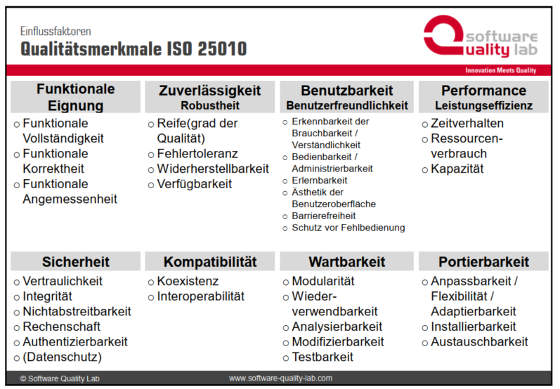
-- Fragen zur Spezifikation an Trainer stellen; er ist der Auftraggeber
My notes:
-- Nichtfunktionale Anforderungen:
--- Ressourcenverbrauch
--- Performance (1000 Anfragen /Minute; 3 Sekunden Antwortzeit) -> was ist eine Anfrage? Wie sieht das im API aus?
--- Datenschutz (Vertraulichkeit)
--- Benutzbarkeit für Oma
--- portierbarkeit (für mobile Systeme)
--- Datensicherheit
--- Zuverlässigkeit (Zurückgeben muss technisch gewährleistet sein)

-- Randbedingungen
--- Geschäftsmodell
--- Provision
--- Landkarte darstellen (woher?)
--- Teamgröße (wieviele Leute eigentlich zur Verfügung?) 4 Entwickler, 1 Tester, 1 Scrum-Master, 1 PO (CEO)
--- Rechtliche Aspekte: DSVGO
--- Zeit und Budget?
--- Partnerschaft mit Social Networks zum Authentifizieren

-- Wechselwirkungen
--- 2/4/i (see the use cases ..)
--- 3/b/a
--- 9/4/e
--- 7/e

# Systemabgrenzung
- Systemkontext: Diskussion sehr gut mit Fachbereichen machbar
- guter Projektleiter wird aber das gleiche machen: erstmal checken, was ist innerhalb und was ist außerhalb der Systemgrenzen; wen zum Meeting einladen, wen nicht?
- anfangs die Systemgrenzen unscharf
- Datellungsformen: Use-Case-Diagramm (Stärke und das Ziel; auf innere Darstellung kann verzichtet werden; Abhängigkeitsbeziehung; Pfeil immer in Richtung der Abhängigkeit; von Akteur zu 'use'; Person oder anderes Steereotyp, Aussagegehalt recht groß); Komponentendiagramm
- [Ex!] Willleihen als Use-Case-Diagramm: see 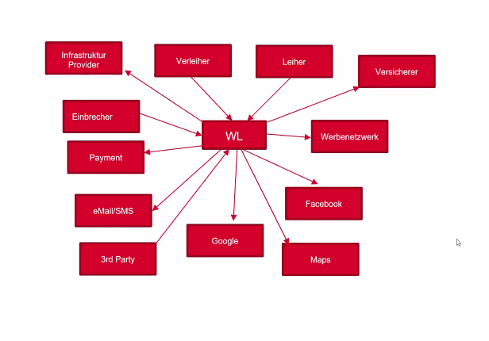
-- DomainDrivenDesign: Unter welcher Fragestellung wird das UseCasediagramm gerade modelliert?
--- Google: BusinessBenefits/BusinessCases? wer ist von wem abhängig?
--- WL (WillLeihen): -> aus dem Diagramm entstehen recht viele MakeOrBuy-entscheidungen; da Top-down, kann man dasmit vielen diskutieren, sehr schnittstellenbasierte Sicht
--- da wo immer die Spoitze in dem Diagramm ist, muss eine Schnittstelle angeboten werden
--- Zeitaufwand für Code-Änderungen: Einlesen 70%; Programmieren 10%, Problem Lösen 20%
--- Übergang von Black- zu Whiteboxing: weiterhin sehr schnittstellenorientierte Sicht
--- Arten von Bausteinen von feingranular to grobgranular: fließend
--- auf hohe Kohäsion achten, fördert meist auch geringe Kopplung
--- Sachen eher lose koppeln, weil besser testbar
--- Beispeil mit niedriger Kohäsion; zwei Komponenten greifen gegenseitig aufeinander zu (S1 und S2 auf ABCD..); schlecht testbar
--- divide et imperae, zwischen fachlicher und technischer Art zu unterscheiden, dinge einfach wie möglich zu machen, separation of concerns, single responsibility principle
--- ein baustein macht genau eine sache; leichter wartbar (und testbar)
--- resue and release equivalence principle
--- wenn man dinge nur teilweise für die wiederverwendung vorsieht, sollte man sie trennen. ganz oder gar nicht.
--- common-closure-principle: externe lib ändert sich schnell, adapter dazwischenpacken um sich zu entkoppeln
--- common-reuse-principle: nicht anderen meine abhängigkeit aufdrücken; eventuell komponentenfuntkionalität splitten und dann getrennt releasen

- klare Trennung zwischen fachlicher und technischer Architektur:
-- techn. Architektur: nichtf. Anforderungen, Querschnittskonzepte, hjarware, Gateway für Security, Proxy für Cachcing, 2. Server für Ausfallsicherheit; eher horizontal geschnitten
-- fachliche A.: (siehe Übungszettel); eher vertikal geschnitten

[check!] i18n ? was ist das? "The terms are frequently abbreviated to the numeronyms i18n (where 18 stands for the number of letters between the first i and the last n in the word internationalization, a usage coined at Digital Equipment Corporation in the 1970s or 1980s)[3][4] and L10n for localization, due to the length of the words.[5][6] Some writers have the latter acronym capitalized to help distinguish the two.[7]" en.wikipedia.orga-aufwand

- Dinge so einfach wie möglich machen; viel Text zu schreiben ist immer einfach, aber geht es nicht auch einfacher?
- eine Hierarchie verstehet jeder einfacher als wenn jeder von jedem abhängig ist

-- Entwurf Top-down (schnelles reingleiten, nicht allzu verkopft; aber Integration wird etwas vor sich hergeschoben; Reibungsverluste bei fianler Integration trten spät auf) und Bottom-up (Verfeiner die BlackBox indem du Inhalt als WhiteBox zeigst; Inhalte sind weitere BlackBoxes, verfeiner auch sie)
-- kein shipable work-increment possible (Top Down)
-- 7+/-2 ist gute Faustregel für (Millersche Zahl) Zerlegung und Visualisierung

-- Fachliche Bausteine aus Fachobjekten herleiten
-- wording: am besten in Muttersprache; am besten wegen dem größeren Wortschatz und Feinheiten
[Pause bis 14:55]

[Ex!] Aufteilung der Ports (nach außen) - fachlicher Art: see 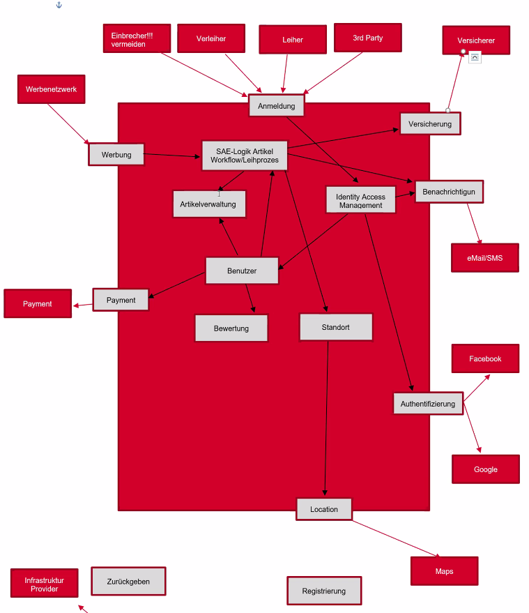
- [check this] IAM: Identity-and-Access-Management (Registrierung; Authentifizierung; Authorisierung - all in one); see https://en.wikipedia.org/wiki/Identity_management
- nur Nutzung beschreiben, aber keine Datenflüße abbilden! siehe: werbenetzwerk und Werbung und SAE-Logik
- Dinge, die zusammengehören, auch zusammen gruppiert. Use-Case-Prinzip mit Akteur als Generalisierung und Spezialisierung auch machbar
- welche Komponenten essential wichtig? die mit den meisten Kanten
- welche Komponenten priznipiell instabil: emhr ausgehen Kanten als eingehende; siehe SAE-Logik (wird kritische Komponente werden)
- in der Diskussion ist das Problem einen Schritt klarer geworden :)

## Zusammenfassung Tag 1:
- siehe: 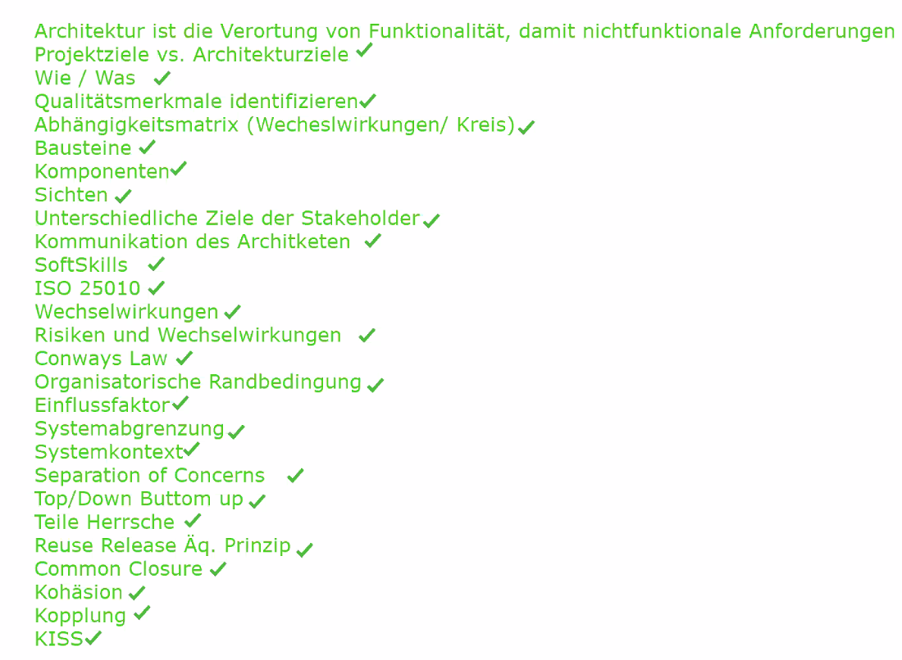
- Architektur ist die Verortung von Funktionalität; damit nichtfunktionale Anforderungen erfüllt werden
- Projektziele vs. Architekturziele (Architekturziele eher längerfristiger Natur; Projektziele sind kurzfristig)
- BausteineKomponenten
- Sichten: jeweiligen Stakeholdern eine Lösung erklären, darlegen (aspektorientiert)
- Unterschiedliche Ziele der Stakeholder
-- sechs Stakeholder: Projektleiter, Testmanager, RE-Ingenieur, Entwicklungsteam, Hardware (!), IT (alles zum Laufzeitverhalten)
- Kommuniktionsfähigkeit des Architekten: Konfliktfähigkeit, Zuhören, proaktives Handeln (nicht Warten bis das Problem übermächtig wird; sich Arbeit machen)
- Softskills
- ISO 25010: mindestens drei davon benennen können
- Wechselwirkungen
- Conway's Law: Organisation wirkt auf die Lösung; Lösung wirkt auf die Organisation
- Organisatorische Randbedingungen
- Einflußfaktoren
- Systemkontext: Rollen; externe Ressourcen/systeme, die einwirken
- Separation of concerns: (nicht verwechseln mit Single-Responsibility): Aspekt nicht selber aufteilen [check this]
- Top-Down vs. Bottom-up: was ist besser? beides. TD + schnittstellenfokusiert; BU: sehr konrekt; verheddern in Details
- Teile-Hersche: Vorteil: Komplexitätsreduktion
- Resue-release-Äquivalenz-Principle: externe Ressourcen komplett nutzen oder eventuell Refactorisieren
- Common closure-principle: 
- Kohäsion
- Kopplung: lose gekoppelt, hohe Kohäsion
- KISS: Verständnis fördern

Hausarbeit für Morgen:
- zu allem, was man heute gehört hat, sich eine MultipleChoice oder "Ja/Nein"-Frage überlegen (siehe zu der Übersicht Zusammenfassung)

# 20200825 - day 2

Potentielle Fragen:
- Wobei unterstützen Architekten
-- Schreiben von gutem Code? ne
-- Erreichen von Qualitätsmerkmalen (Synonyme für nichtfunktionale Anforderungen) ja
-- Moderation zu Stakeholdern? ja
-- Beim Kaffee trinken? ne

Welche der folgenden Vorgabe gehört zu den Randbedingungen?
-- Architekturziele ne
-- technische Vorgaben ja
-- organisatorische Vorgaben ja

Ein Architekt sollte seine Lösung nach Händen und Füßen verteidigen?
-- Ja
-- Nein (x)

Monolith versus Microservices? [check this]

-- da Architekt keine Personalverantwortung hat, hat selbst eine Restrukturing der Software (selbst wenn es besser wäre) keinen direkten Impact auf die Teamgröße
-- aber er kann die Ideen an die entsprechenden Verantwortlichen bringen (das ist eine Randbedingungen)

## Yesterday: ##
- Defintionen, wie Anforderungen lesen?, System abgrenzen, was ist ein Kontext, wissen was man kann, Problem fachlich weiterzerlegen, Use-Beziehungen, technikneutral das Problem zerlegen (intensiv in der Übung), sehr wohl ein kreativer Prozess; viel Diskussion, im ersten Schritt zu einer Zerlegung kommen, die Sinn macht; den Kontext mmitziehen;
- Heuristiken für die Zerlegung; CRC-Verfahren [check this]
- Fokussierung und Gruppierung für lose Kopplung und hohe Kohäsion (very important)

'etwas auf Silizium zum Laufen bringen'

## Architekturzentrierte Ansätze
- Abhängigkeiten optimieren; Patterns als sprachliches Mittel für schnellere Kommunikation zwischen technisch gleich versierten

- Mustersprachen? DomainDrivenDesign? [check this] Werkzeug, Automat, Material
- Referenzarchitekturen

- Mustersrpachen sind Architekturstile
- definieren auf Klassenebene Musterleemnte: Mustersrpache reichert Klasen mit Semantik an; Definieren Regeln für Musterelement (Eric Evans) - Services; Entitäten
- Eric Evans: "Schwierigkeiten kommen aus der Fachdomäne und weniger aus der Technik"; deshalb sein Ansatz nicht mit technische Konstrukten reden, aber lieber mit technischer Fachsprache reden
- Fachmodell auf Basis des Metalmodells
https://medium.com/@ruxijitianu/summary-of-the-domain-driven-design-concepts-9dd1a6f90091
- Entitäten, Wertobjekte, Aggregate, Ubiquitous Language, Services
- Wiederverwendbarkeit auf logischer Ebenen

- WAM: http://wam-ansatz.de/ [check this]
- Software ist Werkzeug um die Information (Material) zu bearbeiten
- auch dort Begrifflichkeiten und Regeln: Fachwerte, Materialien, Fachliche Services, Werkzeuge, Automaten, Technische Services --> vorkonfiguriertes Metamodell

- CRC Karten - classes-Responsiblitlies-Collaboration (uralt; 70er..)

- modellgetriebene Architektur: MDA https://www.omg.org/mda/ - object management group
- Generierung von Anwendungen aus UML-Modellen (ist nicht SA im engeren Sinn!)
- MDA: PIM, PSM, Code; nicht 100% Automatisierung anstreben
- Modelle haben exstrem hohe Hebelwirkung
- für weitere Informationen: read this https://github.com/heynickc/awesome-ddd#sample-projects
- Referenzarchitekturen: Autosar for Automotive; eventually also Java EE für  Java Enterprise Anwendungen
- Inhalt: Anwendungsgebiet, Abstrakte Strukren und Laufzeitverhalten; Technische Vorgaben; Optional Prozesses
- Beispiel: Konfigurationsmanagement, Buildmanagement, täglich mehrfaches Deployment sicherstellen

## Goldene Regeln
- Beginne mit dem Fachmodell (Begrifflichkeiten und fachliche Zusammenhänge ausarbeiten)
- Strebe nach geringer Kopplung und hoher Kohäsion
- Entwirf unabhängig und leicht austaushcbare Bausteine
- Verwende etabliert und erprobte Sturkturen wieder (Architekturmuster)
- Denke an Alternativen
- Bausteine sollen keine Annahmenüber Strukturen anderen Bausteine machen
- Entwirf in Iterationen: Prototypen und technische Durchstiche mindern Risiko
- Dokumentiere Entscheidungen, damit sie nachvollziehbar sind (sic!) - um nachträgliches Aufflammen von Diskussionen zu mindern

- verschiedene Wege zum Entwurf eines Systems: inkrementeller Ansatz aber wichtig (für Details siehe Folien)

## Architektur- und Entwurfsmuster
- pattern language, Christopher Alexander (reale Architektur)
- siehe 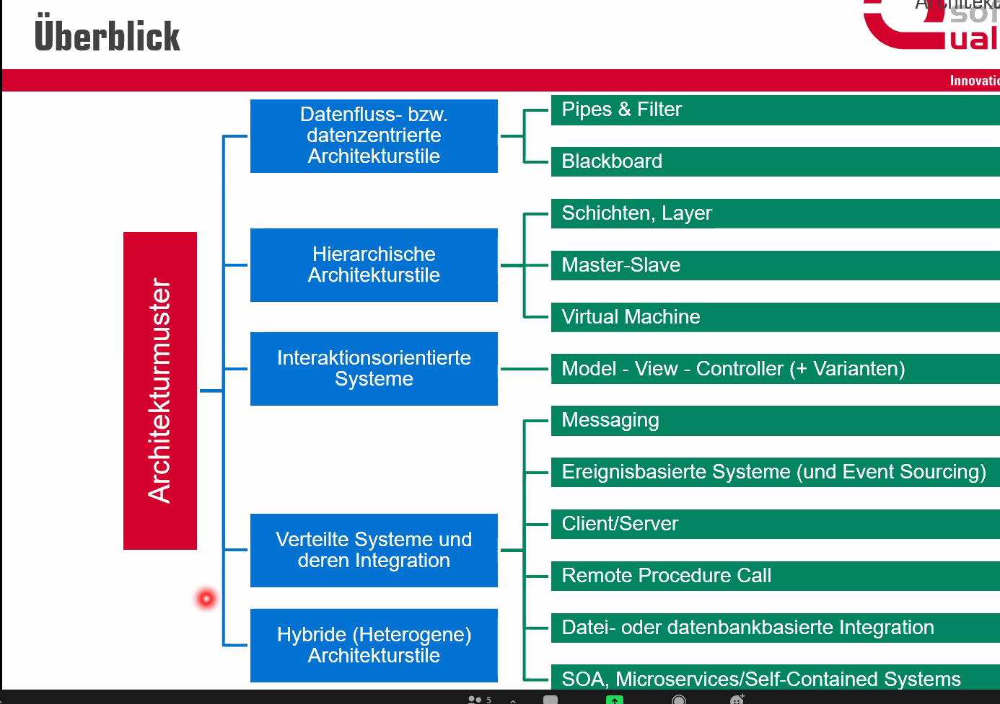

### Pipes & Filters
- für Systeme, die Datenströme verarbeiten
- Parallelverarbeitung möglich ist
- wiecerverwendbar und austauschbar
- schwierige Fehlerfindung, da kein Systemzustand vorhanden

### BlackBoard (shared Repository)
- KnowlegeSource soll auf gleiche Wissensbasis zugreifen
- meist bei KI-Systemen, die auf gemeinsamer Basis arbeiten sollen
- gute Performanz, da dünne Kommunikation
- Problem mit Reliability (Droidenkontrollschiff?)

### Schichten
- sehr weiter verbreitet
- (separations of concerns principle)

### Master-Slave
- (neu: Leader-Follower)
- Echtzeitkommunikation im gleichen Prozess: nicht so gut optimierbar, falls man Antwortzeiten garantieren muss
- besser durch getrennte Optimierungen

### Virtuelle Machine
- Java, .NET, Docker [check this!], Applikationserver
- Container vs. Virtuelle Machinen

### MVC, MVP
- Benutzerschnittstellen explizit von der Logik entkoppeln

### Nachrichtenbasierte Kommunikation (Messaging)
- RabbitMQ, ZeroMQ
- MessaqeQueue als Muster für Resilienz
- just out of my own interest: https://www.educba.com/rabbitmq-vs-mqtt/ - very good page to compare
- Stack oder Queue: LIFO versus FIFO

### Ereignisbasierte Systeme
- Polling ineffizient, daher "Inversion of Control"; jemand anders soll mich informieren, wenn sich etwas ändert (statt eigenem Polling); bei event-bus registrieren

### Event sourcing
- Systemzustand persistieren um es gegebenenfalls wiederherzustellen
- similar to Kafka: (just if really interested) https://www.confluent.io/blog/event-sourcing-cqrs-stream-processing-apache-kafka-whats-connection/#:~:text=Kafka%20as%20a%20backbone%20for%20Event%20Sourcing&text=Kafka%20is%20a%20high%2Dperformance,event%20sourcing%20based%20application%20architecture.

### Client-Server

### Thin Client versus Rich Client
- TC: einfache Wartung, einfache Auslieferung, leichte Sicherung
- RC: bessere Performanz, offlinefähig, Synchronisation zwuischen Clients aufwändiger, muss installiert werden

### Remote procedure call
- marshalling (verpacken) und woanders berechnen lassen

### Datei- und datenbankbasierte Integration
- plattformübergreifende Integration
- Probleme: Concurrency, Deadlocks, Transactions

[scheduled exam for Friday, 20200828 12:00!, baem]

### SOA Manifesto
- Service oriented architecture
- der Business-Value ist doch viel wichtiger als die technische Grundlage; Aufgaben wichtiger als "wie es implementiert ist"; man will felxibel sein
- schrittweise verfeinerung: siehe 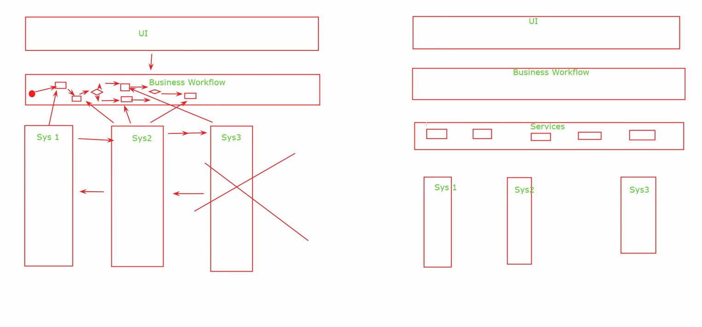
- In a battle between a jedi and a ninja, SOA would win.

### Microservices
- entgegen klassische Architektur: fachlicher schnitt auf Applikationsebene
- jeder Microservice in eigenem Prozess am Laufen
- Teams müssen sich technologisch untereinander nicht abstimmen; gute Modularisierbarkeit
- Skalierung, Resilienz, mehr Freiheit und Verantwortung
- potential shippable product increment
- Technologiepluralismus (ist auch nicht für jeden Mitarbeiter)
- Analyse von Abhängigkeiten oft erst zur Laufzeit machbar
- Abbildung Microservices <-> Teams

### Self contained systems
- Folien

### Broker
- Kopplung über die Nachrichtenbasierte

[Ex!] "WirLeihen" - welche Muster würden sich anbieten um sie für die Realiserung zu verwenden
- (im Rückgriff auf die nichtf. Anforderungs-Übung von gestern)
-- Pipes&Filters: bringt eher weniger, weil wenige Prozessketten; kein Datastream
-- Blackboard: Daten integrieren und lose koppeln; eher wahrscheinlich nicht
-- Schichten: klares Ja, weil mehrere verschiedene UserInterfaces (mobile, web, third party)
-- Master-slave: muss man Echtzeitanforderungen garantieren? ja, aber kein embedded system, also eigentlich _nicht_
-- Container: Ausfallsicherheit, Skalierbarkeit, Apps für zwei mobil-OS anbieten,
-- Model-View-Controller: im UI (Redux oder MVP?)
-- message passing: ja
-- Event-sourcing/ereignisbasierte Systeme: Zustände nachverfolgbar
-- Client-Server: "wirleihen" sollte dezentral ausgeführt werden
-- RPC: (DCOM MS-Welt); eher weniger Nutzen
-- Datenbankbasierte Integration: billig und skalierbar, etabliert, (Was wäre denn die Alternative: DB oder filebasierte Speicherung (???))
-- MicroServices: BoundedContext: im Verkleihkontext nicht um Werbung kümmern; eigenes Deployment Artefakt
-- SCS (self contained systems): größeres Schneiden bringt etwas? größere Trennung wäre vorstellbar
-- Broker: (örtliche Entkopplung): ?

- MDA: model driven architecture: fachliche und technische aspekte trennen
- domain driven design: gemeinsame Sprache, Widerverwendbarkeit auf logischer Ebene

- 3 goldene Regeln für Architekturentwurf:
-- verwende Standardlösungen
-- Beginn mit der Facharchitektur
-- hohe Kohäsion, geringe Kopplung
-- keine Annahmen über die struktur der bausteine vornehmen
-- iterativ vorgehen
-- Entscheidungen dokumentieren

# Entwurfsmuster
- jedes Muster für nichtfunktionale Anforderungen hat Stärken und Schwächen: Schichten bei Testung und Austauschbarkeit, aber Probleme bei Performanz, ..
- Muster (Pattern) nicht erfunden, sondern _gefunden_; daher auch nicht formal beweisbar
- siehe: 

- Singleton
- Factory: kapselt Wissen, wie und welche Objekte erzeugt werden; Open-closed-Principle
- Adapter/Wrapper: eine Schnittstelle in eine andere übersetzen
- eventuell noch ein Gateway (intern: Wrapper, Adapter)
- Bridge: Implementierung von Abstraktion trennen
- Plugin: Bausteine werden mittels Konfiguration 'spät' ins System eingebunden und nicht schon während der Kompilierung
-- Konfiguration zentralisiert und geschieht zur Laufzeit
-- Schnittstelle muss sehr genau bekannt sein
- Fassade als Strukturmuster: vorgeschaltet vor eine komplexe Komponente; zur Pflege von Legacy-Code; Sicht vereinfachen, ähnlich Wrapper; Vereinheitlichung
- Dekorator: fügt neue Operationen hinzu; Beispiel Streams
- Proxy: Platzhalter für andere Komponenten; kontrolliert Zugang zum echten Subjekt
- Registry: hilft andere Objekte zu finden
- Command: Aktionen als Objekt verpacken; kann später ausgeführt werden; Command kann als Objekt auch in einen Stack gepackt werden; Undo/redo
- Observer: "don't call us, we call you"; 
- State: ermöglicht Objekt sein Verhalten zu ändern, wenn sein innerer Zustand sich ändert

[Ex!] Describe those three patterns to the other users without naming them:
- Factory: Erzeugungsentwurfmuster; Anforderung von Objekten mit bestimmten Eigentschaften, die man aber nicht selber explizit instanziieren möchte
- Gateway: stackoverflow: "Facade provides a simple uniform view of complex internals to (one or more) external clients; Gateway provides a simple uniform view of external resources to the internals of an application." Gateway erzeugt einen einzeitlichen Blick auf externe Ressourcen für eine Applikation
- Registry: globales Zugriffspattern zm mithilfe eines Keys ein Objekt zu finden (hat Hinzufügemethode)

-- mehrere Komponenten auf einem Stand halten mit geringer Systemlast: Observer
-- http-request mit zusätzlichen Informationen anreichern: decorator pattern
-- anmeldung über cloud, warten auf antwort, rückgabe von berechtigungen, user access level setzen: state
-- businesslogik schreiben, aber nicht sicher wie die daten persistiert werden sollen; Implementierung ist noch nicht konkrekt: proxy (nicht?), adapter/wrapper
-- anwendung über vordefinierte Schnittstelle mit zusätzlichen Funktionalitäten anreichern

- Fassade: direkter Zugriff auf Sachen; gekapselter Zugriff; Komplexität eines Zuganges zu verbergen; EINFACHER Zugriff im Gegensatz zu Gateway
- Gateway: Zugriff auf Sachen regeln (übersetzen)

# Schnittstellen und Abhängigkeiten

## festlegen und entwerfen:
- gehören zur BlackBox-Sicht
- einfach zu entwerfen, einfach zu njtuzen, funktional vollständig, schwer zu missbrauchen (robustes system)
- Postels Gesetz: ich achte auf die Spezifikation, aber tolerant zu allem, was man akzeptiert; ich bin toleratn nach außen und hoffe, dass die anderen dies auch sind
-- siehe: https://de.wikipedia.org/wiki/Robustheitsgrundsatz
- service-orientierte und ressourcen-orientierte Schnittstellen
-- URI: service-aufruf selber versus URI: ressourcenorientiert (verändert und freigeben)
- lose und starke Kopplung
- Abhängigkeiten planen
-- Ziel: Kopplung reduzieren
-- Werkzeuge
-- heute eher Komposition statt Vererbung
-- Schnittstellen: Abhängigkeiten lindern
-- Inversion of control [see slides]

[Ex!] 1.2.6 Abhängigkeiten planen

- Funktionsaufruf: nirgendwo 'ne Unabhängigkeit
- RMI (remote method invocation): platform muss man kennen, .. siehe 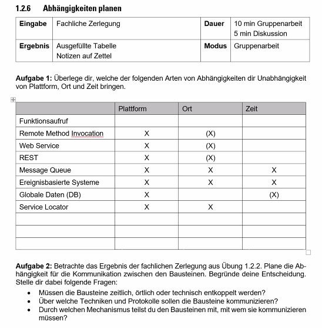
- Service Locator ist eine Registry

## Entwurfsprinzipien zur Optimierung von Abhängigkeiten
- SOLID (Robert C. Martin - clean Architecture)
-- S: Single Responsibility principle
-- O: open/closed principle
-- L: Liskov Substitutionsprinzip
-- I: Interface-Segregation-Principle
-- D: Dependency-Inversion-Principle
+ Vermeidung zyklischer Abhängigkeiten

- Separation of concerns
- Information Hiding: Geheimnisprinzip
- niedrige Kopplung, Hohe Kohäsiion
- open/closed principle: Sachen dazupacken

- Dependency inversion: abstraktes Interface hat immer nur eingehende kanten; in welcher ebene ansiedeln? natürlich "unten" (zum Austauschen)
- daher lieber zur vollen Flexibilit durch extra Schichten ; aber letztendlich Designentscheidung
- check Dependency Injection (Mock; frühzeitige Testbarkeit)
- zyklische Abhängigkeiten

[Ex!] 1.2.7
- Prinzipien für "Wirleihen"
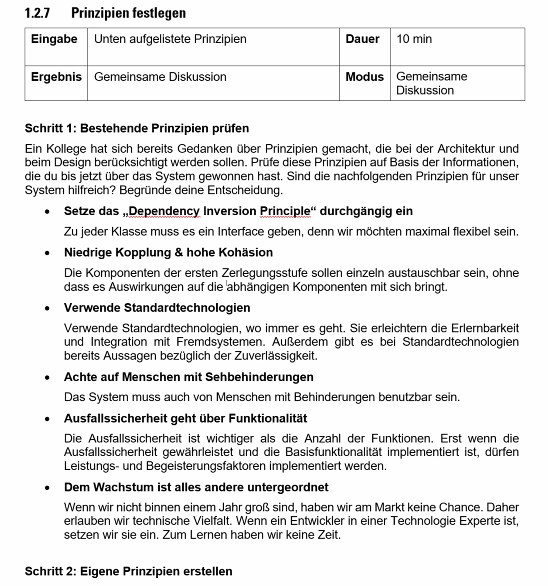
-- Punkt 0: macht keinen Sinn; erzeugt viel heiße Luft; DI-principle sollte nicht durchgängig angewendet werden
-- niedrige Kopplung und hohe kohäsion: komponenten der ersten zerlegungsstufe sollten einzeln austauschbar sein
-- Sehbehinderung: kein Prinzip; falsch am Platz; nichtfunktionale Anforderung
-- Standardtechnologien
-- Ausfallsicherheit gegenüber Funktionalität: nein
-- dem Wachstum ist alles andere untergeordnet: nein

- eigene Prinzipien:
-- ViewModel first oder View first?
-- Dependency inversion-principle
-- falls man nach SOLID geht, hat man beim Testen weniger Bauchschmerzen

# Querschnittskonzepte
(Schwarzbuch der SW-Architektur?)

- auch genannt: übergreifende Konzepte, Cross-cutting concerns
- welche Konzepte gehören zusammen, Snsätze, welche Risiken
- einige Beispiele folgen

## Ausnahme- und Fehlerbehandlung
- Laufzeitfehler: wie erkennen, behandeln, wie damit umgehen?
- Fehlerbehandlung als übergreifendes Konzept in Code verwoben

## Bibliotheken und Frameworks
-  andere Richtung der Use-Beziehung: Frameworks und Bibliotheken
- WhiteBox (Vererbung): Erweiterung durch Überschreiben von Methoden halbabstrakter Klassen
- BlackBox (Komposition): erweiterung durch überschreiben vollständig abstrakter Klassen
- immer auf Dokumentation und Testbarkeit achten (UnitTests; Testautomatisierung)

## Protokollierung
- LoggingFrameworks

## Container
- Ablaufumgebung für Software
- Konzepte vorkonfigurieren

## GUI

## Sicherheit
- Authentifizerung, authorisierung, Integrität, Vertraulichkeit, Unleugbarkeit, Verfügbarkeit

## Geschäftsregeln
- deklarativ und graphisch beschrieben (ähnlich UML) statt Code

# Zusammenfassung - Day2

- Goldene Regeln: mit Fachlichkeit anfangen; zwei Ks: Kohäsion nach innen; Kopplung ist das "außerhalb" - wie stark passt etwas zusammen?; undokumentiert - Schulden bei der Architekturbank; größere Unabhängigkeit -> Austauschbarkeit groß
- Architekturmuster: dienen den nichtfunktionalen Anforderungen; Aufbau: Problem -> Kontext -> Lösung; (Bsp. Zugriff innerhalb LegacySystem -> Adapter); falls startup sich nicht festlegen will, dann SOA (10er Jahre Buzzword); ThinClient: auf Server durchgeführt; RichClient: Rechenkapazität beim Client nutzen; wann machen Microservices sinn? (habe ich unabhängige Teams?)
- Entwurfsmuster: Command, Observer, Plugin, Registry, Bridge-Pattern, Proxy (Zugriff regeln), Facade
- Qualitätsmerkmale/NFR: ISO25010; proaktiv als Architekt handeln
- Schnittestellen und Abhängigkeiten: strukturelle Abhängigkeit; Erzeugen; DCOM (Datentypen als Abhängigkeit bei RPC); zeitliche Abhängigkeit; technische Abhängigkeit (Hardware); EEEFS: einfach zu erlernen, einfach erweiterbar, einfach zu benutzen, schwer missbrauchbar, funktional vollständig
- SOLID: single responsibility principle; open closed (designmuster für diesen zweck: decorator, plugins)
- Entwurfsprinzipien: divide et impera, separation of concerns, 
- Entkopplung: welche Art von E. stellt ein Broker dar: Ort
- Robustheitsgrundsatz: Jan Postel: sei tolerant gegenüber dem was du bekommst, konsequent für das, was du rausgibt
- CCC (Querschnittskonzepte; cross cutting concerns): Logging, Fehlerbehandlung, Security; technische Fehler im fachlichen Code behandeln - lieber nicht
- DDD: Mustersprachen, MDA als Auspräügung einer Mustersprache; Was sind die Variationspunkte eines Metamodells, welches das spezielle Problem gut ausdrücken soll? Services und Entitäten (statt Ausleihen und Buch) und States; Kernidee von DDD: Fachlichkeit wiederverwenden; PIM bei MDA: Platformindependent Model; Platform specific model; Mithilfe eines Generators in Code zu übersetzen;  
- Architekturzentrische Ansätze
- System und Systemkontext (-grenzen)
- Einflußfaktoren: organisatorische, technische, Ziele, Anforderungen (funktionale und nichtfunktionale (Qualitätsanforderungen)); immer Kompromiß, weil sie sich teilweise in WEchselwirkung widersprechen
- Conways Law: MicroServices passend, da idealerweise von einem Team gestaltet und die genutzte Technik von dem Team verstanden
- Dependency Injection: Baustein, der erstellt werden soll, erstmal nur von etwas Abstraktem abhängig; getter/setter/ctor; AbstractFactory
- Liskov: wo findet man dies verletzt? Bei tiefen Vererbungen, wo Funktionalität bei Kinder nicht mehr implementiert ist
- WAM: Fachwert; Werkzeug Automat Material; Anwendung ist ein Werkzeug
- Microservice: 3 Vorteile: Skalierung, gegeneinander geschützt (Prozessebene), Resilienz, ; 3 Nachteile: richtige Teams finden, erhöhter Netzwerkkommunikationsbedarf, Komplexität hoch n

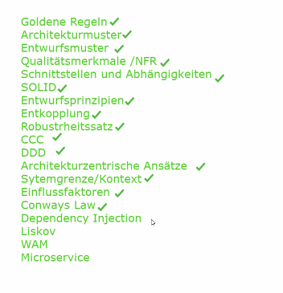

## Hausaufgabe: zwei Fragen vorzubereiten (5 min Zeitansatz); für die Rekapitulation

0. Welcher der folgenden Begriffe ist kein cross-cutting-concept (ccc)?
- Persistenz
- Verfifizierung x
- Protokollierung
- Geschäftsregeln

1. Kann eine Registry als Singleton umgesetzt werden?
Ja

Andere Leute:
2. Welche Nachteile hat das  Pipes&Filter-Stil?
Parallel nicht möglich ne
zwischenergebnisse nicht speichern doch
schwierige fehlerbehandlung ne

3. Welche grundlegenden Architekturmuster kennst du? (Kategorien)
- datenzentrierte Architektur (wie Filters& Pipes)
- Master-Slave (Hierarchisch)
- Messaging (verteilte Systeme)

4. Was sind zwei wichtige begriffe für die Softwarearchitektur?
source code
komponenten x
beziehungen x
funktiioalität?

5. Welches Entwurfsmuster trennt Abstraktion von Implementierung?
adapter/wrapper
bridge x

6. Was für Kopplungstypen kennst du? (Abhängigkeiten/Kopplung)
- zeitlich
- örtlich
- Erzeugen bringt Kopplung
- Aufrufen bringt Kopplung
- Datentypen
- Laufzeitkontext (Betriebssystem)

- zweiter Tag traditionsgemäß härtester Tag; Peak

# 20200826 - day 3

## Risikomanagement und Architekturentscheidungen

UML-Diagramme:
Klassendiagramm
Komponentendiagram
verteilungsdiagram
Sequenzdiagram
Zustandsdiagram

- qualitativ und quantitative Bewertungen
(morgen: welche Werkzeuge organisatorisch notwendig? Kategorien und )

Risikomanagement?
Warum als Architekt damit auseinandersetzen?
- "Gummibänder" bis zum Zereissen gepsannt - darauf eingehen und praktiv auf diese Probleme eingehen
- "Produktrisiko" (ours) versus "Projektrisiko" (eher Projektleiter)

- nicht nur Aufnahme von mögliichen Bedenken im Team: auch ein Kommunikationswerkzeug
- falls periodisch bis hin zu den Requirements zurück zu neuen Lösungen finden
- Failure More and Effects Analysis

## Risiko

Was sind Risiken?
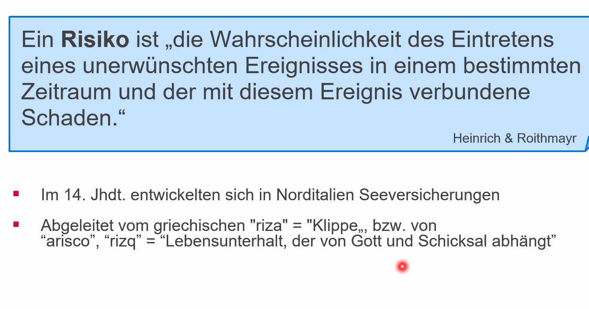
- Risikoanalyse sollte nicht nur einmal, sondern grundsätzlich regelmäßig, iterativ im Projekt durchgeführt werden
- mesit in Zusammenarbeit mit dem Projektleiter

Zyklus:
- Risikoidentifikation: Abholen/Brainstorming, Tür weit öffnen, so dass jeder im Team die Bedenken äußern kann: Liste wird größer
- Risikobewertung (Liste wird kleiner)
- Risikosteuerung: Maßnahmen und Mechanismen zur Risikobeefinlussung
- Risiko-Controlling: Laufende Berichterstattung; 
- gutes Beispiel für proaktives Management - frühzeitig Lösungen vorbereiten
- regelmäßige Durchführung pro Sprint

Techniken zur Identifikation:
- Checklisten aus fürheren Projekten, Brainstorming
- Expertenreviews
- SWOT-Analysen
- FMEA
- APP (analysis of potential problems)
- Simulation
- Externe Assessments

- Risikowert bestimmen = Eintrittswahrscheinlichkeit x potentieller Schaden
- Akzeptieren oder Ignorieren
- Risiko vermindern
- Schaden vermindern

- FMEA-Tabelle: 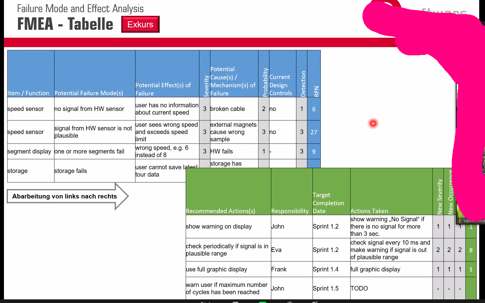
[Ex!] 1.2.8
- ohne technische Architektur schwer vorhersagbar was genau failen wird
- was sind "current design controls"?
- Monitoring zum Erkennen; Failover (?)
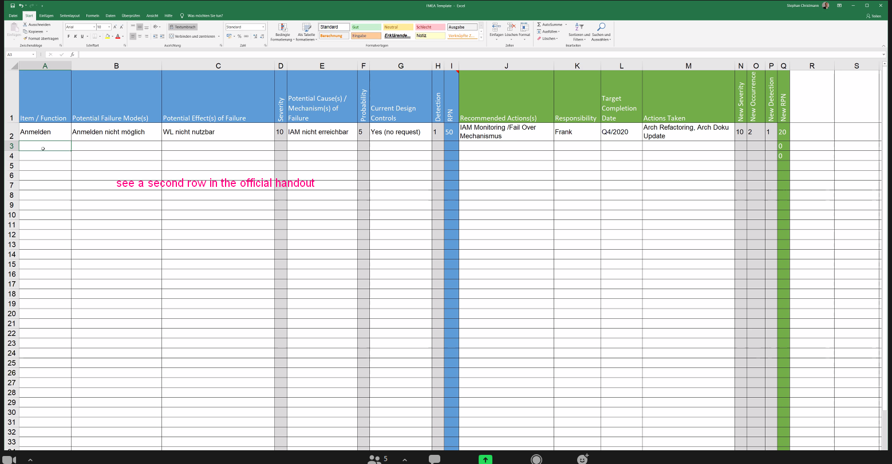
- [check this](https://quality-one.com/dfmea/) - more details

- Diskussionsgrundlage und Dokumentation, schafft Transparenz, gewisser Schutz (nachträglich eine Risikoliste haben und aus Kostengründen nicht umgesetzt)
- nicht vergessen: Risiken - nicht Probleme; also diese Tabelle nicht auf Basis von Bugreports erstellen!

- Entscheidungen: gute Gründe für schnelle (unabhängige) Entscheidungen und langsamere; bei manchen sind die Auswirkungen geringe
- sonst hohe Kosten bei Zeitverlust, sonst laufen die Kosten aus dem Ruder
- wie dokumentiert man seine Entscheidungen?
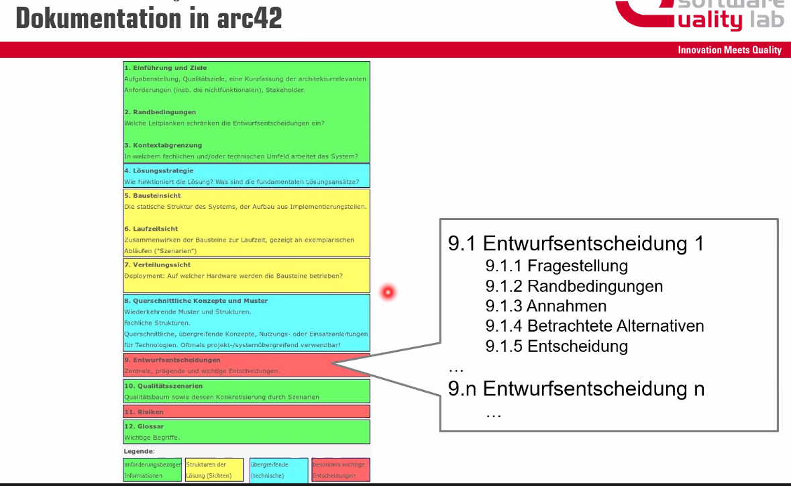

[Ex] Architekturentscheidungen treffen: (unsere Wahl)

1. Frage formulieren: Wie sollen sich die Benutzer authentifizieren?
2. Randbediungen finden:
- Facebook/Google einbinden
- Eigene Benutzerverwaltung existiert
3. Annahmen treffen:
- Benutzername und Passwort für Login
- keine HW notwendig
- kein FB oder Google nötig, aber möglichstateless Auth, Prozess
- Nichtanmeldung -> Reg möglich
4. Alternativen finden:
- Oauth2
- SMS Auth (2Faktor)
5. Entscheidung treffen
- OAuth2, weil erweiterbar und flexibel

## Beschreibung und Kommunikation
- Kommunikation, Kontextabgrenzung, Sichten und UML, Schnittstellenbeschreibung, Hilfsmittel und Werkzeuge (u.a. auch C4); z. B. Deployment-Diagramm?
- stakeholder-gerecht beschreiben (Projektleiter wird gegebenenfalls eine Stakeholderanalyse gemacht haben)
- immer für eine Zielgruppe für einen bestimmten Zweck dokumentieren
- nur der Leser kann die Verständlichkeit beurteilen

verständlich, korrekt, effizient, angemessen, wartbar -> VAWEK (fahr weg) (Eselsbrücke)
- was nicht eindeutig identifizierbar ist, hat die eigenschaft wegzulaufen
- Nutzen von Dokumentation: Big picture erstellen, Systemüberblick, Einfache Abstimmung, Mittel zur Kommunikation, Basis für Analyse und Bewertungen

- wenn man etwas verschriftlichen muss, legt man sich fest. das hilft auch beim 'erden'

- zentrales Architekturdokument
- A.-Überblick
- Übersichtspräsentation
- A.-Tapete
- Handbuch

 - Diagramtypen [check this]
 - statt Fließtext lieber eine Komponenten-Struktur-Diagramm: Kollaboration kann auf zwei arten modelliert werden
 
 - Zustandsdiasgramm
 - Flussdiagramme
 - UseCaseDiagramme
 - BPMN-Diagramme (gekipptes Aktivitätsdiagramm)
 - Verteilungsdiagramm (deployment diagram)
 - schnittstellennbeschreibung: immer von außen nach innen beschrieben (außen umfassender als interne Sachen); Schnitstellenebschreibung nach Clements
 
 - OpenAPI-Standard: Swagger als Tool (für Webapplikationen)
 - TOGAF
 - RM-ODP
 
 - 'ganz emotionslos bei den beschreibungstypen; das verwenden, was die Zielgruppe versteht und sehen möchte'
 
 - nach der Pause eine ziemlich große Übung: bis 12:45
 
 [Ex] 1.3.1 Architektur beschreiben
 - Sequenzdiagramm erstellen (Box und Pfeile in normaler und gestrichelter Form)
 - unser Beispiel: Werbenetzwerk; oder Authentifizierung
 - mwir können nur spezifizieren, was wir anbieten
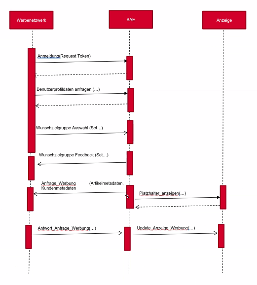
 
 
 
 
 
 
 
 
 

